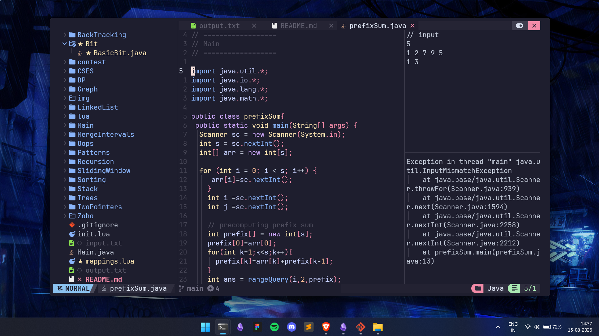

# DataStructures

This repository contains implementations of various data structures and algorithms in Java.  

## Folders

  Algorithms
  BackTracking
  ★ Bit
  contest
  CSES
  DP
  Graph
  LinkedList
  lua
  Main
  MergeIntervals
  Oops
  Patterns
  Recursion
  SlidingWindow
  Sorting
  Stack
  Trees
  TwoPointers

# NvChad Java Setup

### Keymaps

| Key | Action |
|---|---|
| `;` | Command mode |
| `jk` | Exit insert mode |
| `<SpaceBar><Enter>` | Compile & run Java |
| `<SpaceBar>jp` | Java  template |
| `<SpaceBar>jl` | LinkedList template |
| `<SpaceBar>jt` | TreeNode template |
| `<SpaceBar>ji` | Common Java imports |

### Java Run

`<SpaceBar><Enter>` compiles and runs the current Java file in a vertical terminal.

Config: `lua/mappings.lua`

